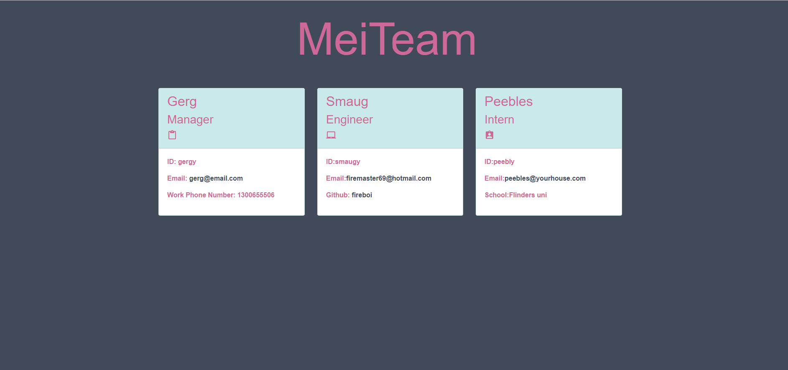

# MeiTeam Generator


### Video URL: https://drive.google.com/file/d/1NTVQyinAefKEn6UlWq5Oz8BEMVNjmsKx/view
### Website Screenshots:


## User Story 
```md
AS A manager
I WANT to generate a webpage that displays my team's basic info
SO THAT I have quick access to their emails and GitHub profiles
```

## Description

Build a Node.js command-line application that takes in information about employees on a software engineering team, then generates an HTML webpage that displays summaries for each person. Testing is key to making code maintainable, so you’ll also write a unit test for every part of your code and ensure that it passes each test.

# Table of Contents

- [Usage](#usage)

- [Applications](#applications)

- [Questions](#questions)


# Usage

Steps to access and use the Code Quiz

- Copy the MeiTeam repository and install node.js
- Right click on the folder and select "open in integrated terminal"
- In the integrated terminal, write "node index.js" or "npm run test"
- Follow the prompts!


# Applications
- HTML
- JavaScript
- CSS
- Bootstrap
- GitHub
- Node.js
- Jest


# Questions 
For any questions and comments please reach out to me through email at:
- hannah.stampke@gmail.com


# Links
To view my other projects visit:
- [Hannah](https://github.com/HannahStampke)

